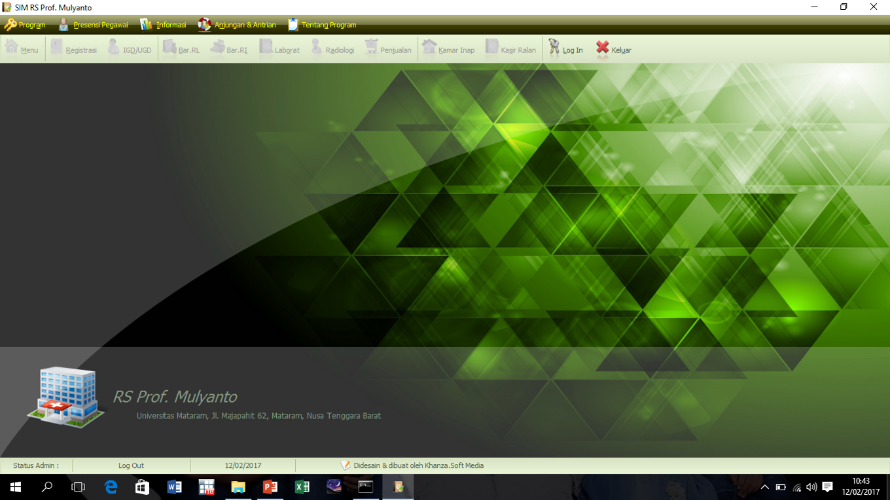
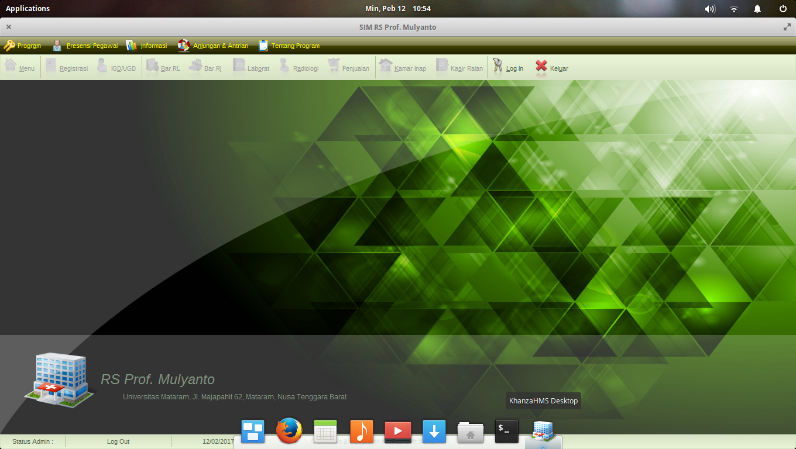
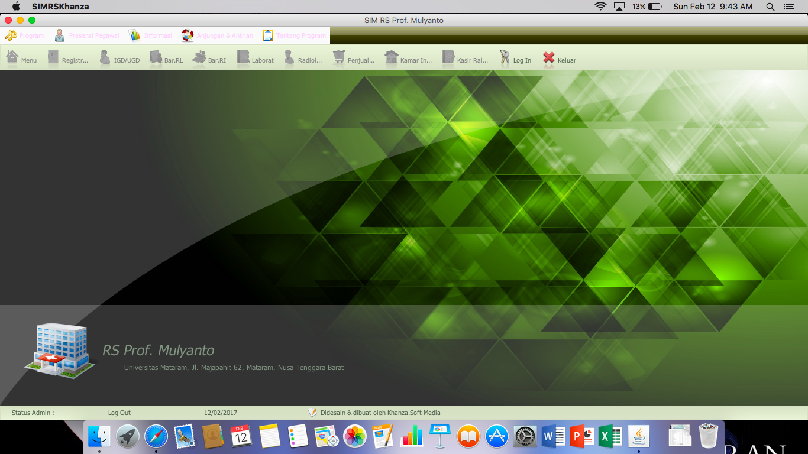

Dokumen ini berisi tentang panduan teknis seputar instalasi, upgrade, administrasi dan penggunaan SIMRS Khanza.  Dokumentasi ini akan dibagi ke dalam tiga panduan, yaitu Panduan Instalasi dan Upgrade, Panduan Administrasi dan Panduan Pengguna.

# Gambaran Umum Software SIMRS Khanza
Software SIMRS Khanza merupakan aplikasi dengan model client-server. Aplikasi client SIMRS Khanza dibangun menggunakan bahasa Java.  Aplikasi client ini bersifat cross-platform sehingga dapat digunakan di Windows, Linux maupun macOS.  Aplikasi server merupakan webapps berbasis PHP dengan dukungan database MySQL atau yang setara (MariaDB, Percona). Webserver yang dianjurkan adalah Apache.
## Tampilan Client SIMRS Khanza di Windows 10
Berikut ini adalah contoh dari screenshot aplikasi client SIMRS Khanza di sistem operasi Windows 10.

## Tampilan Client SIMRS Khanza di Linux
Berikut ini adalah contoh dari screenshot aplikasi client SIMRS Khanza di sistem operasi Linux.

## Tampilan Client SIMRS Khanza di macOS
Berikut ini adalah contoh dari screenshot aplikasi client SIMRS Khanza di sistem operasi macOS Sierra.

# Panduan Instalasi dan Upgrade
## Sistem yang Dibutuhkan
Walaupun menggunakan model client-server, SIMRS Khanza dapat diinstal pada satu komputer yang sama.  Caranya adalah dengan menginstal aplikasi client dan server pada komputer tersebut.  Hal ini berguna bila jumlah komputer menjadi kendala, tidak tersedia jaringan atau untuk keperluan ujicoba.
### Server
1. Komputer dengan sistem operasi Windows, Linux maupun macOS 32-bit maupun 64-bit.
2. Webserver Apache dengan dukungan php dan mysql
3. Database server MySQL, MariaDB atau Percona
4. PHP versi 7.x

### Client
1. Komputer dengan sistem operasi Windows, Linux maupun macOS 32-bit maupun 64-bit.
2. Java JRE sesuai sistem operasi

## Instalasi SIMRS Khanza

### Server
1. Pastikan arsitektur sistem operasi yang terpasang di komputer
2. Anda dapat menggunakan bundle software berisi webserver Apache, MySQL dan PHP, seperti [XAMPP](https://www.apachefriends.org/download.html) yang tersedia untuk Windows, Linux maupun macOS.  Atau, Anda juga dapat menginstalnya sendiri satu per satu sesuai kebutuhan Anda.  Kami serahkan pilihan ini pada Anda.  Gunakan bundle yang sesuai dengan arsitektur sistem operasi Anda.
3. Bila webserver Apache, MySQL dan PHP telah terkonfigurasi dengan baik, Anda dapat melanjutkan ke langkah berikutnya.
4. Mempersiapkan database
  1. Unduh `sik.sql` yang ada di [Github SIMRS Khanza](https://github.com/mas-elkhanza/SIMRS-Khanza)
  2. Buat database `sik`
  3. Impor `sik.sql` ke dalam database `sik`
  4. Tunggu hingga proses impor selesai
5. Mempersiapkan webapps
  1. Unduh folder `webapps` yang ada di [Github SIMRS Khanza](https://github.com/mas-elkhanza/SIMRS-Khanza)
  2. Salin folder `webapps` beserta isinya ke dalam folder publik webserver Anda
6.  Pengaturan database
  [dalam proses]
7.  Pengaturan webapps
  [dalam proses]

### Client

## Upgrade SIMRS Khanza

# Panduan Administrasi
# Panduan Pengguna